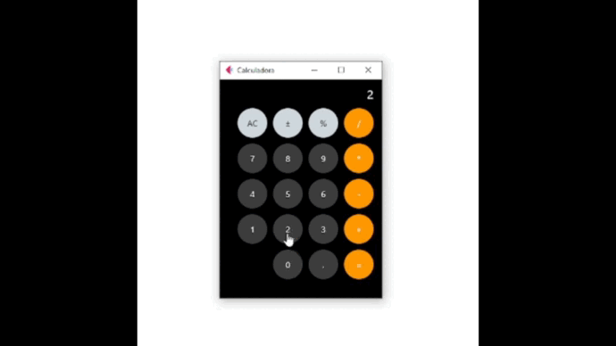

# Criação de Calculadora Utilizando Biblioteca Flet

## Descrição do Projeto

* Este projeto demonstra uma calculadora funcional com interface similar à do iPhone, desenvolvida em Python com a biblioteca Flet.
* A biblioteca Flet foi utilizada pela primeira vez neste projeto para a criação da interface gráfica.

## Funcionalidades:

* A calculadora oferece as seguintes funcionalidades:

    * Operações básicas: soma, subtração, multiplicação e divisão.
    * Cálculo de porcentagem.
    * Limpar o último valor digitado.
    * Limpar toda a operação.
    * Exibir o resultado final.

## Desenvolvimento:

* A construção da calculadora envolveu as seguintes etapas:

    * Implementação da lógica:
        * Cálculo dos resultados das operações matemáticas.
       *  Armazenamento de valores e operadores.
        * Atualização da tela com o resultado final.

    * Criação da interface:
        * Utilização de widgets do Flet para criar botões, labels e outros elementos.
        * Estilo da interface para se assemelhar à calculadora do iPhone.
        * Organização dos elementos em um layout responsivo.
### Tecnologias:

* Linguagem de programação: ***Python***
* Biblioteca de interface gráfica: ***Flet***
### Recursos Adicionais:

* Documentação do Flet: https://flet.dev/\
* Tutoriais do Flet: https://flet.dev/docs/tutorials/\

### Observações:

* Este projeto é um exemplo básico e pode ser adaptado para atender às suas necessidades.
* É necessário conhecimento de Python e Flet para desenvolver a calculadora.
* Utilize os recursos adicionais para aprender mais sobre Flet e implementar funcionalidades complexas.

***Espero que este projeto te inspire a criar suas próprias aplicações com Flet!***

